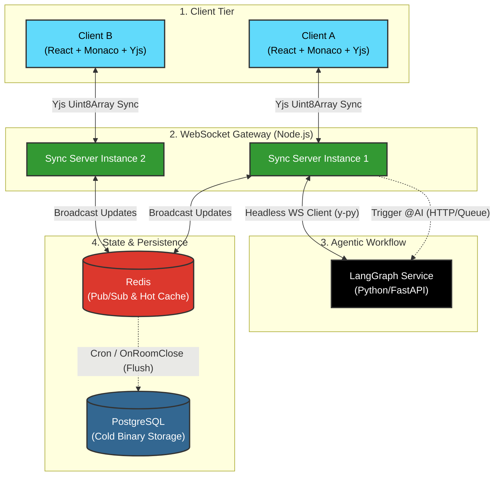

# ColaCode: Real-Time Collaborative Editor with Agentic AI

<div align="center">
  <!-- Status & License Badges -->
  
  
  <br><br>

  <!-- Technology Badges -->
  
  
  
  
  
  
  
  
  
  <br><br>
  
  <p><strong>A horizontally scalable collaborative editing platform powered by CRDTs, featuring real-time state synchronization, multi-cursor awareness, and an integrated LangGraph-powered AI Copilot.</strong></p>
</div>

<br />

---

## 📖 System Philosophy & Motivations

Traditional collaborative text editing relies on Operational Transformation (OT), which requires a central server to sequence and calculate index transformations. This creates a severe bottleneck for horizontal scaling. 

**ColaCode** discards OT in favor of **Conflict-Free Replicated Data Types (CRDTs)** via `Yjs`. By treating the backend as a decentralized relay network rather than a central authority, we achieve mathematically guaranteed document convergence, lower compute overhead, and seamless offline-to-online state merging. 

Furthermore, ColaCode integrates an **Agentic AI workflow**. The AI operates as a headless collaborator in the WebSocket room, reading document context and streaming generated code directly into the CRDT structure in real-time.

## 🏗️ System Architecture

The architecture separates the high-frequency WebRTC/WebSocket syncing layer from the cold-storage database, utilizing Redis as both a Pub/Sub backplane for scaling and a hot cache for active documents.



## ✨ Core Engineering Features

### 1. CRDT-Based Conflict Resolution (Yjs)
Instead of resolving conflicts via index shifting (OT), ColaCode uses Yjs. Every character insertion/deletion is cryptographically tagged and uniquely identified. The Node.js server does not compute state; it merely acts as a high-throughput router, broadcasting `Uint8Array` diffs across WebSocket connections. This allows for sub-50ms sync latency even under high user load.

### 2. Horizontal Scalability with Redis Backplane
The architecture scales linearly. If Client A connects to Node Instance 1 and Client B connects to Node Instance 2, state updates are published to a Redis Pub/Sub channel specific to the document room. The instances pull the updates and push them to their respective connected clients. 

### 3. Agentic AI Copilot (LangGraph)
Integrated real-time AI assistance. By typing `// @AI {prompt}`, a LangGraph workflow is triggered asynchronously. The Python microservice fetches the current state of the document for context, generates the response via LLM, and connects to the Redis backplane to inject characters into the document just like a human user, character by character.

### 4. Efficient Binary Persistence
Document states are not saved as raw text. The Yjs CRDT state is serialized into a compressed binary blob. 
- **Hot State:** Stored in Redis memory while a room is active.
- **Cold State:** Flushed to PostgreSQL (using a `BYTEA` column) only when the room is empty, or on a 5-minute interval. This eliminates database write thrashing.

### 5. Multi-Cursor Awareness
Leveraging the `y-protocols` awareness feature, cursor coordinates, user selections, and metadata (name, color) are synced out-of-band from the main document state. This prevents cursor movements from ballooning the document's CRDT history.

## 📂 Repository Structure

```text
colacode/
├── frontend/                 # React, Vite, TailwindCSS
│   ├── src/components/       # Monaco Editor wrapper, Cursor overlays
│   ├── src/hooks/            # y-websocket and awareness hooks
│   └── src/store/            # UI state management
├── backend-sync/             # Node.js WebSocket Gateway
│   ├── src/server.ts         # WS routing and Redis adapter
│   ├── src/persistence.ts    # Redis cache and PG flushing logic
│   └── src/awareness.ts      # Cursor coordinate broadcasting
├── backend-ai/               # Python LangGraph Microservice
│   ├── src/agent.py          # LLM routing and tool usage
│   └── src/yjs_client.py     # Python Y-py client for writing to doc
└── infrastructure/
    ├── docker-compose.yml    # PG, Redis, Node, Python
    └── init.sql              # PG Schema (BYTEA columns)
```

## 🚀 Getting Started (Development)

**1. Infrastructure Provisioning**
Start the backing services (PostgreSQL and Redis) via Docker:
```bash
cd infrastructure
docker compose up -d redis postgres
```

**2. Database Migration**
Initialize the document storage tables:
```bash
docker exec -i postgres_db psql -U postgres -d colacode < infrastructure/init.sql
```

**3. Run the Node.js Sync Gateway**
```bash
cd backend-sync
npm install
npm run dev
```

**4. Run the AI Worker (Optional)**
```bash
cd backend-ai
pip install -r requirements.txt
uvicorn src.main:app --reload
```

**5. Start the React Frontend**
```bash
cd frontend
npm install
npm run dev
```

## 🧪 Testing Strategy

* **CRDT Convergence Tests:** Unit tests verifying that random concurrent document edits from multiple isolated Yjs instances ultimately converge to the exact same hash.
* **Websocket Load Testing:** k6 scripts simulating 1,000 concurrent WebSocket connections broadcasting awareness (cursor) updates at 10Hz to measure Node.js event loop lag and Redis network throughput.
* **Split-Brain Recovery:** Integration tests explicitly severing the network connection between clients, inducing diverging edits, and validating mathematical merge success upon reconnection.

## ☁️ Production Deployment

### Horizontal Scaling (Multiple Nodes)
To scale the synchronization layer horizontally, deploy multiple backend Node.js instances behind a load balancer (e.g., Nginx). Because state updates are routed through Redis Pub/Sub, the Node.js instances remain stateless.

**Nginx Configuration (WebSocket Proxying):**
\```nginx
upstream sync_nodes {
    # Sticky sessions are optional when using pure WebSockets, 
    # but recommended if falling back to HTTP long-polling
    ip_hash; 
    server app01:3000;
    server app02:3000;
    server app03:3000;
}

server {
    listen 80;
    location / {
        proxy_pass http://sync_nodes;
        proxy_http_version 1.1;
        proxy_set_header Upgrade $http_upgrade;
        proxy_set_header Connection "upgrade";
        proxy_set_header Host $host;
    }
}
\```

## 💡 Future Scalability (Roadmap)

- **Yjs State Snapshots:** Implement document version history using Yjs state vectors to enable Git-like diffs and "time travel" (undo to past versions).
- **Role-Based Access Control (RBAC):** Enforce strict read/write boundaries at the WebSocket gateway to separate viewers from active editors.
- **WebRTC Voice Channels:** Add embedded peer-to-peer audio bridging to facilitate complete pair-programming sessions without external tools.
- **OpenTelemetry Integration:** Implement distributed tracing across the Node.js WS gateway, Python AI worker, and Redis backplane to monitor sync lag and token generation latency.

## 📚 References

- **Yjs (CRDT):** [GitHub](https://github.com/yjs/yjs)
- **LangGraph (Agentic AI):** [Documentation](https://langchain-ai.github.io/langgraph/)
- **Monaco Editor:** [GitHub](https://github.com/microsoft/monaco-editor)
- **y-websocket:** [GitHub](https://github.com/yjs/y-websocket)

---

## Copyright
**Copyright (c) 2026 [Shriram Govindarajan](https://shriram.is-a.dev). All Rights Reserved.** This repository is available for review purposes only in connection with job applications. No license is granted to use, copy, distribute, or modify this code.