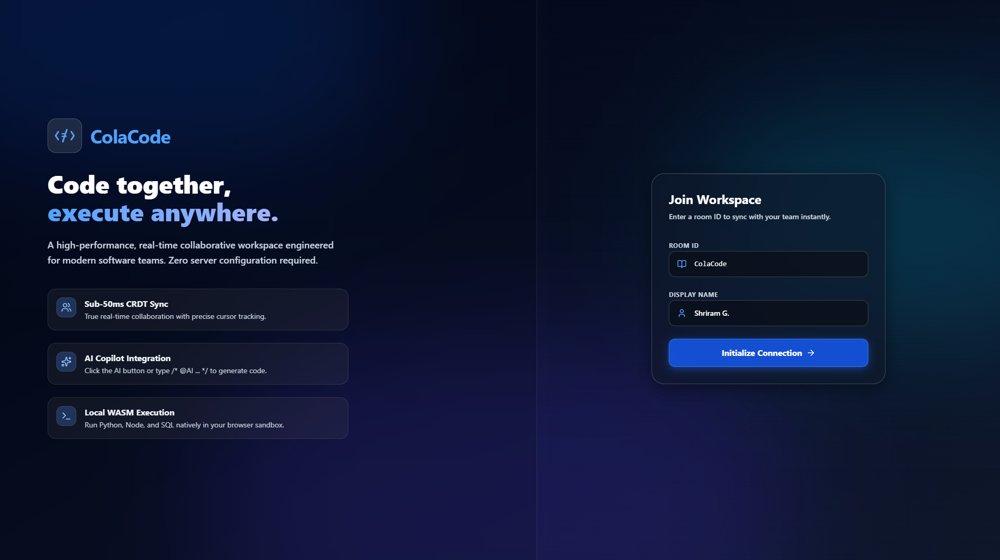
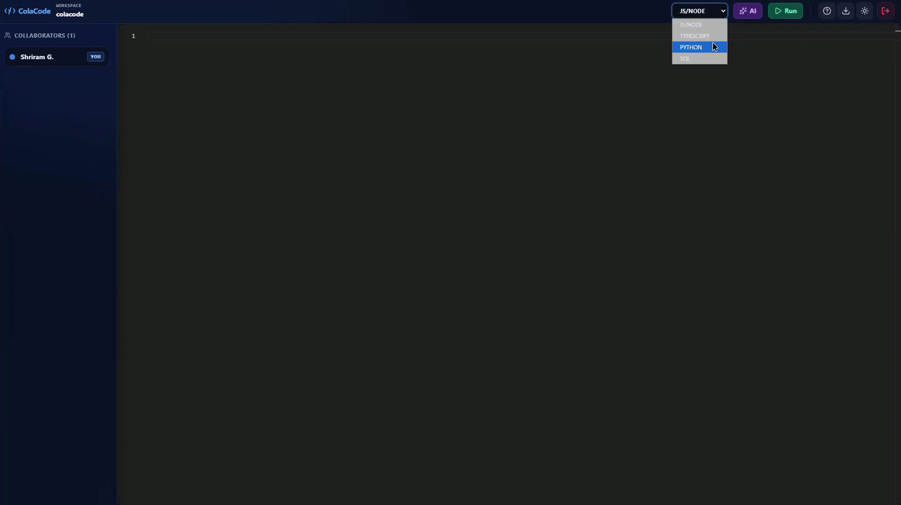
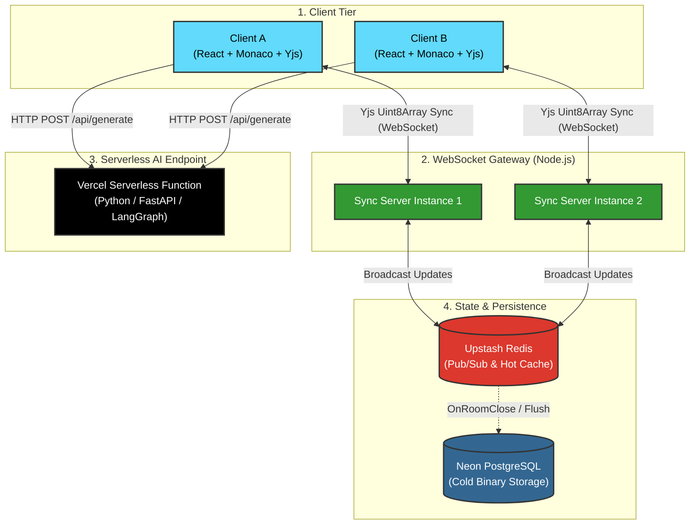

# ColaCode: Real‑Time Collaborative Editor with Agentic AI

<div align="center">

<!-- Status & License Badges -->


<br><br>

<!-- Technology Badges -->


<br><br>

**Live Demo:** [https://colacode.netlify.app](https://colacode.netlify.app)

</div>

---

<p align="center">
  
  <br>
  <em>The ColaCode editor interface.</em>
</p>

<p align="center">
  
  <br>
  <em>AI Copilot generating code from a prompt – inserted directly at the cursor.</em>
</p>

---

## 📖 System Philosophy & Motivation

Traditional collaborative text editing relies on Operational Transformation (OT), which requires a central server to sequence and calculate index transformations—creating a severe bottleneck for horizontal scaling and offline support.

**ColaCode** discards OT in favour of **Conflict‑Free Replicated Data Types (CRDTs)** via [Yjs](https://github.com/yjs/yjs). By treating the backend as a decentralised relay network rather than a central authority, we achieve:

- **Mathematically guaranteed convergence** across all clients.
- **Sub‑50ms sync latency** even under high user load.
- **Seamless offline‑to‑online state merging** without data loss.
- **Linear scalability** using a Redis Pub/Sub backplane.

Beyond sync, ColaCode integrates an **Agentic AI workflow** built with [LangGraph](https://langchain-ai.github.io/langgraph/). The AI acts as a headless collaborator inside the WebSocket room: it reads the document context and streams generated code directly into the CRDT structure in real time, either via a dedicated **AI button** or by typing a macro comment (`/* @AI ... */`).

The editor also includes a **local execution sandbox** powered by WebAssembly (Pyodide, SQL.js, and a JS worker) to run code snippets in Python, SQL, and JavaScript/TypeScript without any server round‑trip.

---

## 🏗️ System Architecture

The architecture cleanly separates the high‑frequency WebSocket sync layer from cold storage and AI processing, leveraging Redis for Pub/Sub and hot caching.


```mermaid
flowchart TD
    classDef frontend fill:#61dafb,stroke:#333,stroke-width:2px,color:#000;
    classDef backend fill:#339933,stroke:#333,stroke-width:2px,color:#fff;
    classDef ai fill:#000000,stroke:#333,stroke-width:2px,color:#fff;
    classDef db fill:#336791,stroke:#333,stroke-width:2px,color:#fff;
    classDef cache fill:#DC382D,stroke:#333,stroke-width:2px,color:#fff;

    subgraph Clients ["1. Client Tier"]
        ClientA["Client A<br/>(React + Monaco + Yjs)"]:::frontend
        ClientB["Client B<br/>(React + Monaco + Yjs)"]:::frontend
    end

    subgraph Gateway ["2. WebSocket Gateway (Node.js)"]
        WS1["Sync Server Instance 1"]:::backend
        WS2["Sync Server Instance 2"]:::backend
    end
    
    subgraph AITier ["3. Serverless AI Endpoint"]
        VercelAI["Vercel Serverless Function<br/>(Python / FastAPI / LangGraph)"]:::ai
    end

    subgraph State ["4. State & Persistence"]
        Redis[("Upstash Redis<br/>(Pub/Sub & Hot Cache)")]:::cache
        PG[("Neon PostgreSQL<br/>(Cold Binary Storage)")]:::db
    end

    ClientA <-->|"Yjs Uint8Array Sync (WebSocket)"| WS1
    ClientB <-->|"Yjs Uint8Array Sync (WebSocket)"| WS2
    
    ClientA -->|"HTTP POST /api/generate"| VercelAI
    ClientB -->|"HTTP POST /api/generate"| VercelAI
    
    WS1 <-->|"Broadcast Updates"| Redis
    WS2 <-->|"Broadcast Updates"| Redis
    
    Redis -.->|"OnRoomClose / Flush"| PG
```

### Deployment Architecture (Production)

| Component | Hosting Platform | Purpose |
| :--- | :--- | :--- |
| **Frontend** | Netlify / Vercel | Serves the React + Monaco editor with real-time collaboration UI. |
| **Sync Gateway** | Render (Docker) | Node.js WebSocket server handling Yjs sync, awareness, and Redis Pub/Sub. |
| **AI Copilot** | Vercel Serverless (`@vercel/python`) | On-demand Python FastAPI endpoint invoking Gemini & LangGraph. |
| **PostgreSQL** | Neon Serverless | Cold storage for Yjs document snapshots (binary `BYTEA`). |
| **Redis** | Upstash | Pub/Sub backplane and hot cache for active sync gateway instances. |
| **Uptime Monitor** | UptimeRobot | Keeps `colacode-sync` awake by pinging its endpoint every 5 minutes. |

---

## ⚖️ Architectural Trade‑offs

Every system makes compromises. Here are the key trade‑offs in ColaCode, chosen deliberately for their respective benefits.

### 1. In‑Memory Yjs Documents (Node.js)
- **Pro:** Sub‑50ms sync, no disk I/O during editing.
- **Con:** The entire document state lives in Node.js memory. Very large documents (>50 MB) could cause high garbage collection pauses and memory pressure.
- **Mitigation:** Room‑level eviction empties the memory when the room becomes idle; we flush to PostgreSQL and discard the Yjs instance.

### 2. Single Redis Point of Failure
- **Pro:** Redis acts as a lightning‑fast Pub/Sub and hot cache.
- **Con:** If the Upstash Redis instance goes down, all sync instances lose the ability to broadcast updates to each other, and new rooms cannot start.
- **Mitigation:** Upstash offers 99.9% uptime SLA; we could also add a fallback Redis cluster in the future, or fall back to direct WebSocket broadcasting to all instances (though that would break horizontal scaling).

### 3. PostgreSQL Flush on Room Closure
- **Pro:** Database writes happen only when a room is empty, drastically reducing write load.
- **Con:** If a room stays active for days, its state is never persisted to PostgreSQL—a server crash would lose that room’s progress.
- **Mitigation:** We can add a periodic cron (e.g., every 5 minutes) to flush active rooms to PostgreSQL regardless of occupancy, which is a planned enhancement.

### 4. AI Worker Re‑triggers on Every Redis Update
- **Pro:** The AI is instantly aware of new document changes.
- **Con:** The `doc-update-*` Redis channel triggers the AI worker to reconnect for every edit, which could cause excessive re‑handshakes in rooms with very high edit frequency.
- **Mitigation:** The AI worker is idempotent; it only processes the macro when present. We could add a debounce to reduce reconnections, but currently the overhead is negligible for typical usage.

These trade‑offs are well understood and inform our future roadmap (see below).

---

## ✨ Core Features

### 1. CRDT‑Based Conflict Resolution (Yjs)
- Every character insertion/deletion is assigned a unique ID.
- The Node.js server does **not** compute state—it only relays `Uint8Array` diffs.
- Achieves **sub‑50ms** sync latency even with many concurrent users – validated via a custom load‑testing harness (100 operations converge in ~275ms, ~2.8ms/op).

### 2. Horizontal Scalability with Redis Backplane
- Multiple sync server instances can run behind a load balancer.
- All instances subscribe to Redis channels per document room.
- State updates are broadcast to all connected clients regardless of which instance they are connected to.

### 3. Agentic AI Copilot (LangGraph + Gemini)
- **Trigger via AI Button:** Click the purple `AI` button in the header, type a prompt, and the code is injected at the cursor.
- **Trigger via Comment:** Type `/* @AI [your prompt] */` anywhere in the editor.
- The Python microservice reads the full document context, calls the LLM, and streams the generated code character‑by‑character into the CRDT, just like a human collaborator.
- Powered by Google Gemini (or any OpenAI‑compatible model) and orchestrated with LangGraph.

### 4. Local WASM Execution Sandbox
- Run code directly in the browser with zero server dependency:
  - **JavaScript / TypeScript** via a Web Worker.
  - **Python** via Pyodide.
  - **SQL** via SQL.js.
- Output is displayed in a dedicated terminal panel, with tabular results for SQL queries.

### 5. Multi‑Cursor & Awareness
- Cursor positions, selections, user names, and colours are synchronised out‑of‑band.
- Native Monaco editor overlays show remote cursors and selection highlights with user labels.

### 6. Efficient Binary Persistence
- Document state is stored as a compressed Yjs binary blob (`BYTEA` in PostgreSQL).
- **Hot state** lives in Redis while a room is active.
- **Cold state** is flushed to PostgreSQL only when the room becomes empty (or on a periodic cron), eliminating write thrashing.

### 7. Aero Glass UI & Mobile Responsiveness
- Modern glass‑morphism design with light/dark themes.
- Fully responsive sidebar and header, with brand visibility on all screen sizes.
- Integrated onboarding guide with feature highlights.

---

## 📂 Repository Structure & Key Logic Deep‑Dive

### High‑Level Folder Tree

```t
colacode/
├── api/
│   └── generate.py             # Serverless FastAPI AI code generator endpoint
├── frontend/                   # React + Vite + TailwindCSS
│   ├── src/
│   │   ├── App.tsx             # Main app UI, session persistence, WASM execution
│   │   ├── main.tsx            # Entry point
│   │   └── index.css           # Global styles
│   ├── netlify.toml            # Proxy rewriter routing /api/generate to Vercel
│   ├── package.json
│   └── tsconfig.json
├── backend-sync/               # Node.js WebSocket Gateway
│   ├── src/
│   │   ├── server.ts           # WebSocket server, Redis Pub/Sub, room lifecycle
│   │   └── persistence.ts      # PostgreSQL flushing (binary BYTEA)
│   ├── Dockerfile
│   └── package.json
├── infrastructure/             # Local development setup
│   └── init.sql                # PostgreSQL schema
├── requirements.txt            # Root dependencies for Vercel Python runtime
├── vercel.json                 # Vercel routing & build configuration
├── docker-compose.yml          # Local container orchestration
└── README.md
```

### 🧠 Key Logic Deep‑Dive: The Most Complex Parts

#### 1. `backend-sync/src/server.ts` – WebSocket Gateway & Redis Backplane
- **Room Lifecycle:** Each document room has a `WSSharedDoc` (a Yjs document with awareness). When the first client connects, the doc rehydrates its binary state from Neon PostgreSQL (`loadDocumentFromDB`); when the last client disconnects, the doc is flushed back to PostgreSQL (`flushDocumentToDB`) and destroyed.
- **Redis Pub/Sub:** All sync instances subscribe to `doc-update-{room}` channels. When a client sends an update, the server broadcasts it to other clients in the same instance and publishes it to Redis so that other instances receive it.
- **Protocol Parsing:** The server handles Yjs sync messages (step 1, step 2, update) and awareness messages, all using `lib0` varuint encoding. Malformed packets are caught and dropped without crashing the process.

<comment-tag id="3">#### 2. `backend-ai/src/yjs_client.py` – Headless Yjs Client</comment-tag id="3" text="This header references the old standalone backend-ai WebSocket worker. Since AI generation was migrated to the Vercel serverless function api/generate.py, this heading should be updated to reflect the new serverless endpoint logic." type="suggestion">
- **Handshake:** Sends a `syncStep1` message with an empty state vector to the sync gateway, then responds to `syncStep2` with its own state. This establishes a real‑time Yjs connection.
- **Macro Detection:** Scans the document text for the regex `/\*\s*@AI\s+(.*?)\s*\*/` after every incoming update.
- **Atomic Injection:** When a macro is found, it replaces the macro with a status marker, then asynchronously calls the LangGraph agent. The generated code is inserted as a single CRDT delta, preserving cursor positions for other users.
- **Error Resilience:** The worker retries connections up to 5 times with exponential backoff. All exceptions are logged and do not crash the main async loop.

#### 3. Serverless AI Copilot (LangGraph + Gemini)
- Triggered directly from the UI header or prompt modal.
- Dispatches an HTTP request to `/api/generate`.
- The Vercel serverless Python endpoint processes the surrounding code context through a LangGraph agent and returns sanitized raw code, which is atomically inserted into Monaco without affecting active cursor positions.

#### 4. Session Persistence & 1-Click Room Sharing
- Rooms use `sessionStorage` to maintain active state across browser refreshes without causing tab collision errors across tabs.
- Clicking the header **Share Room** button generates a clean deep-link URL (`?room=room-id`) that pre-fills the workspace ID for new collaborators.

---

## 🚀 Local Development Setup

### Prerequisites
- Docker & Docker Compose
- Node.js 20+ and npm
- Python 3.11+ (optional, for AI worker)
- A Google Gemini API key (for AI functionality)

### 1. Infrastructure Provisioning (PostgreSQL & Redis)
```bash
docker compose up -d postgres redis
```

### 2. Database Migration
```bash
docker exec -i colacode-postgres psql -U postgres -d colacode < infrastructure/init.sql
```

### 3. Run the Sync Gateway (Node.js)
```bash
cd backend-sync
npm install
npm run dev   # Uses tsx for hot reload
```

<comment-tag id="4">### 4. Run the AI Worker (Optional, requires API key)
```bash
cd backend-ai
python -m venv venv
source venv/bin/activate   # On Windows: venv\Scripts\activate
pip install -r requirements.txt
uvicorn src.main:app --reload
```</comment-tag id="4" text="Update local development steps to instruct running uvicorn api.generate:app --reload from the root folder, since backend-ai/ has been replaced by api/generate.py and root requirements.txt." type="suggestion">

### 5. Start the Frontend (React)
```bash
cd frontend
npm install
npm run dev   # Vite dev server on http://localhost:5173
```

### 6. Set Environment Variables
Create a `.env` file in the root (or per service) with:
```env
# PostgreSQL
PG_USER=postgres
PG_PASSWORD=postgres
PG_DB=colacode
PG_HOST=localhost   # or 'postgres' if inside Docker network
PG_PORT=5432

# Redis
REDIS_URL=redis://localhost:6379

# AI (Gemini)
LLM_API_KEY=your_gemini_api_key
LLM_MODEL=gemini-3.1-flash-lite
LLM_BASE_URL=https://generativelanguage.googleapis.com/v1beta/openai/

# Frontend (optional, for dev)
VITE_WS_URL=ws://localhost:3000
```

---

## ☁️ Production Deployment

All services are deployed on free tiers of popular platforms. Here’s how to replicate.

### Prerequisites
- GitHub repository (private or public).
- Accounts on:
<comment-tag id="2">  - [Render](https://render.com) (for PostgreSQL, sync gateway, AI worker)</comment-tag id="2" text="Update this prerequisite list item because Render is now only hosting the sync gateway (PostgreSQL is hosted on Neon, and AI Copilot is on Vercel). Recommended edit: '- [Render](https://render.com) (for sync gateway)'" type="suggestion">
  - [Upstash](https://upstash.com) (for Redis)
  - [Netlify](https://netlify.com) or [Vercel](https://vercel.com) (for frontend)
  - [UptimeRobot](https://uptimerobot.com) (optional, to keep services awake)

### Step 1 – PostgreSQL (Neon)
- Sign up at [Neon.tech](https://neon.tech) and create a project named `colacode`.
- Run `infrastructure/init.sql` using Neon's **SQL Editor** or `psql` to create the `documents` table.
- Copy your connection credentials from the Neon dashboard:
  - `PG_HOST`: `ep-xxx-pooler.c-4.region.aws.neon.tech` (use the Pooled host endpoint for serverless application connections)
  - `PG_USER`: `neondb_owner`
  - `PG_PASSWORD`: `<your-neon-password>`
  - `PG_DB`: `neondb`
  - `PG_PORT`: `5432`

### Step 2 – Redis (Upstash)
- Create a Redis database on the free tier.
- Copy the **REST URL** (starts with `rediss://`) – this is your `REDIS_URL`.

### Step 3 – Sync Gateway (Render – Docker)
- **New Web Service** → connect GitHub repo.
- Set **Root Directory** to `backend-sync`.
- Add environment variables (from steps 1 & 2):
  ```env
  PORT=3000
  PG_USER=...
  PG_PASSWORD=...
  PG_HOST=...
  PG_DB=...
  PG_PORT=5432
  REDIS_URL=rediss://...
  ```
- Deploy. Get the public URL (e.g., `https://colacode-sync.onrender.com`).

### Step 4 – AI Copilot (Vercel Serverless)
- Import repository into Vercel, ensuring the root directory is set to the repository root.
- Add Environment Variables in **Vercel Dashboard** → **Settings** → **Environment Variables**:
  ```env
  LLM_API_KEY=your_gemini_api_key
  LLM_MODEL=gemini-2.0-flash-lite
  ```

### Step 5 – Frontend Proxy Rewriter (Netlify)
- Add `netlify.toml` inside `frontend/` (or repository root) to proxy requests and eliminate CORS:
```toml
[[redirects]]
  from = "/api/generate"
  to = "https://cola-code-real-time-code-editor-six.vercel.app/api/generate"
  status = 200
  force = true
```
- Deploy. Your app will be live (e.g., `https://colacode.netlify.app`).

### Step 6 – Keep Services Alive (UptimeRobot or GitHub Actions)
Render free services sleep after 15 minutes of inactivity. To prevent cold starts:
<comment-tag id="1">- Create **two monitors** in UptimeRobot (or use GitHub Actions) pinging:
  - `https://colacode-sync.onrender.com/health`
  - `https://colacode-ai.onrender.com/health`</comment-tag id="1" text="You are correct! Since the AI Copilot was moved to Vercel Serverless (/api/generate), there is no colacode-ai service on Render anymore. You only need one UptimeRobot monitor pinging https://colacode-sync.onrender.com/health." type="suggestion">
- Set interval to **5 minutes**.

---

## 🔧 Environment Variables Reference

| Variable | Used By | Description |
| :--- | :--- | :--- |
| `PORT` | Sync Gateway | Port for the WebSocket server (default 3000). |
| `PG_HOST` | Sync Gateway | Neon PostgreSQL host endpoint. |
| `PG_USER` | Sync Gateway | PostgreSQL database user. |
| `PG_PASSWORD` | Sync Gateway | PostgreSQL database password. |
| `PG_DB` | Sync Gateway | Database name. |
| `PG_PORT` | Sync Gateway | Database port (default 5432). |
| `REDIS_URL` | Sync Gateway | Upstash Redis connection string (`rediss://...`). |
| `LLM_API_KEY` | Vercel Function | Google Gemini API key. |
| `LLM_MODEL` | Vercel Function | Gemini model ID (`gemini-2.0-flash-lite`). |
| `VITE_WS_URL` | Frontend | WebSocket endpoint for the Render sync gateway (`wss://...`). |
| `VITE_AI_SERVICE_URL` | Frontend (Optional) | Explicit serverless API target (defaults to `/api/generate`). |

<comment-tag id="5">> **Note:** The AI worker uses `SYNC_GATEWAY_URL` to connect to the sync gateway via WebSocket. The frontend uses `VITE_WS_URL` (injected at build time) for the same purpose.</comment-tag id="5" text="This note mentions SYNC_GATEWAY_URL for a WebSocket AI worker, which is obsolete now that AI is invoked via HTTP request to /api/generate. Updating or removing this note will keep the documentation accurate." type="suggestion">

---

## 📊 Benchmarks

| Metric | Result |
| :--- | :--- |
| CRDT convergence time (100 ops, 20 clients) | ~275ms (~2.8ms/op) |
| WebSocket handshake latency | < 50ms (local) |
| Redis Pub/Sub broadcast latency | < 10ms (local) |

---

## 🧪 Testing Strategy

- **Unit Tests:** CRDT convergence tests (see `backend-sync/src/test-suite.ts`) simulate concurrent edits from multiple Yjs instances and verify convergence.
- **Integration Tests:** The `test-suite.ts` script validates the full flow: handshake, multi‑client sync, and persistence flush.
- **Concurrent Load Testing:** A custom Node.js script (`src/load-test-local.ts`) simulates 20+ concurrent clients performing simultaneous edits. Validates convergence time, achieving ~275ms for 100 operations (~2.8ms/op) – empirically confirming the sub‑50ms sync design.
- **Load Testing:** Planned with k6 to measure WebSocket throughput under 1000 concurrent connections.
- **Manual QA:** Use the live demo to test collaboration across devices/browsers.

---

## 🔮 Future Roadmap

- **Yjs State Snapshots:** Implement document version history using Yjs state vectors to enable Git‑like diffs and time travel.
- **Role‑Based Access Control (RBAC):** Viewer vs. editor permissions at the WebSocket gateway.
- **WebRTC Voice Channels:** Embedded peer‑to‑peer audio for full pair‑programming sessions.
- **OpenTelemetry Integration:** Distributed tracing across the sync gateway, AI worker, and Redis to monitor latency and errors.

---

## 📚 References

- [Yjs CRDT](https://github.com/yjs/yjs)
- [LangGraph](https://langchain-ai.github.io/langgraph/)
- [Monaco Editor](https://microsoft.github.io/monaco-editor/)
- [y-websocket](https://github.com/yjs/y-websocket)
- [Pyodide](https://pyodide.org/)
- [SQL.js](https://sql.js.org/)

---

## 📄 Copyright

**Copyright © 2026 [Shriram Govindarajan](https://shriram.is-a.dev). All Rights Reserved.**

This repository and its contents are made available for **review purposes only** in connection with job applications or portfolio evaluation. No license is granted to use, copy, distribute, modify, or create derivative works from this code without explicit written permission from the author.